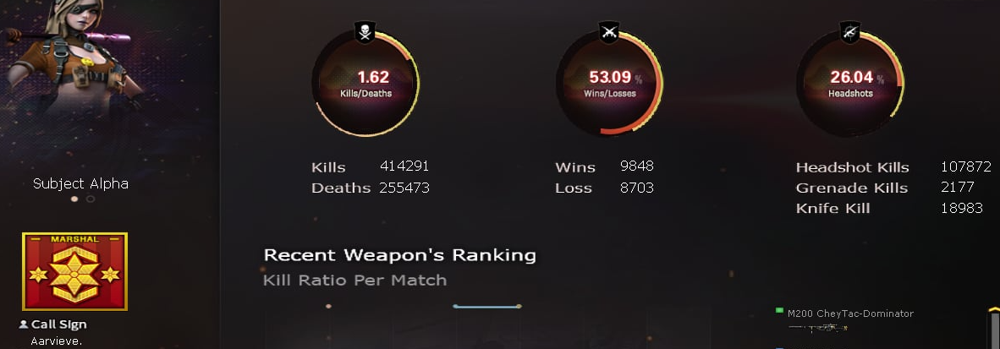

<p align="center">
  
</p>


# Hi there, I'm Aaron! 

I'm an aspiring Full Stack Developer from the Philippines, currently a student and passionate about learning new technologies to build awesome web applications.

## 👨‍💻 About Me

- 🔭 I’m currently working on **growing my skills in Full Stack Development**
- 🌱 I’m constantly learning **new tools and frameworks** to improve my craft
- 📫 How to reach me: **aaroncanada4@gmail.com**

## 🛠️ Tech Stack & Tools

<p align="left">
  
  
  
  
  
  
  
  <br><br>
  
  
  
  
  
  
  
  <br><br>
  
  
  
</p>

## 📊 My Weekly Coding Activity

<!--START_SECTION:waka-->

```txt
From: 28 June 2026 - To: 05 July 2026

Total Time: 12 hrs 22 mins

TypeScript   7 hrs 21 mins         ██████████████▓░░░░░░░░░░   58.65 %
Markdown     1 hr 25 mins          ██▓░░░░░░░░░░░░░░░░░░░░░░   11.33 %
Lua          1 hr 18 mins          ██▓░░░░░░░░░░░░░░░░░░░░░░   10.44 %
Prisma       54 mins               █▓░░░░░░░░░░░░░░░░░░░░░░░   07.27 %
C#           35 mins               █▒░░░░░░░░░░░░░░░░░░░░░░░   04.67 %
```

<!--END_SECTION:waka-->
